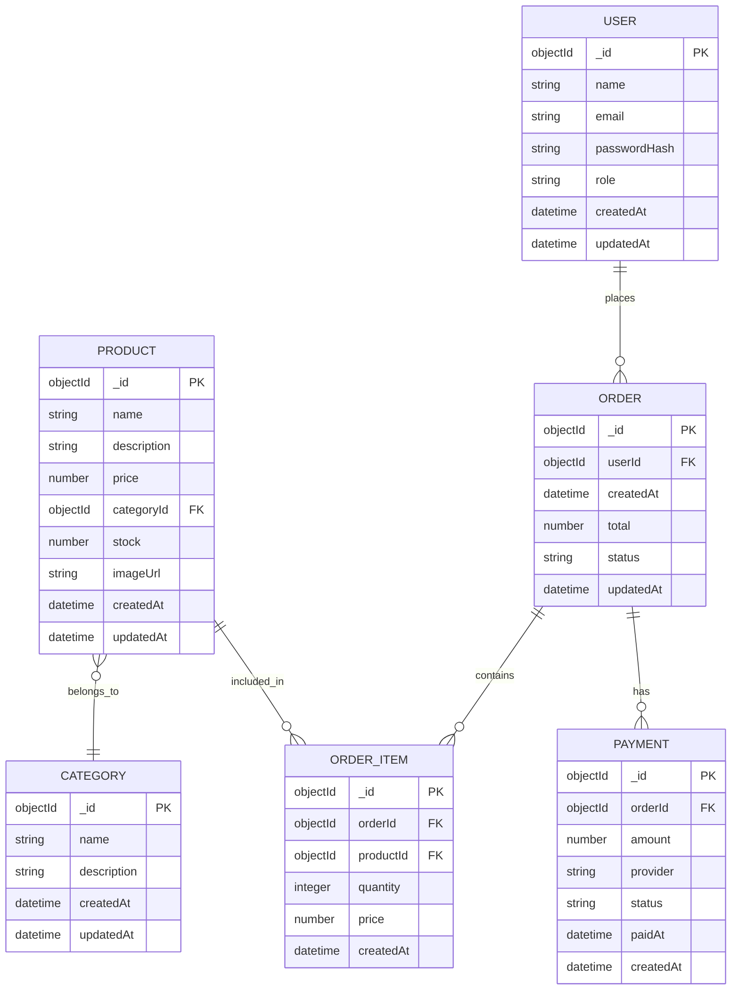

# E-Commerce App - ER Diagram

This file contains the ER diagram for the e-commerce project. It includes a Mermaid diagram (if your viewer supports Mermaid), an ASCII representation, entity attribute lists, and MongoDB schema examples.

---

## Mermaid ER diagram



---

## ASCII fallback

A plain-text visualization:

```
+----------------------+        1         *            +----------------------+
|        USER          |---------------------------->|       CATEGORY       |
|----------------------|                              |----------------------|
| PK _id (ObjectId)    |                              | PK _id (ObjectId)    |
| name (String)        |                              | name (String)        |
| email (String) UK    |                              | description (String) |
| passwordHash (Str)   |                              | createdAt (Date)     |
| role (String)        |                              | updatedAt (Date)     |
| createdAt (Date)     |                              +----------------------+
| updatedAt (Date)     |                                        ^
+----------------------+                                        | 1
        | 1                                                      |
        |                                                        | *
        | *                                                      |
        |                                          +----------------------+
        |                                          |      PRODUCT         |
        |                                          |----------------------|
        |                                          | PK _id (ObjectId)    |
        v                                          | name (String)        |
+----------------------+                          | description (String) |
|       ORDER          |                          | price (Number)       |
|----------------------|                          | categoryId (FK)      |
| PK _id (ObjectId)    |                          | stock (Number)       |
| userId (FK)          |                          | imageUrl (String)    |
| createdAt (Date)     |                          | createdAt (Date)     |
| total (Number)       |                          | updatedAt (Date)     |
| status (String)      |                          +----------------------+
| updatedAt (Date)     |
+----------------------+                          
        | 1                                        
        |                                          
        | *                                        
        |                                          
        v                                          
+----------------------+        1         *       
|    ORDER_ITEM        |-------------------------->|
|----------------------|                          |
| PK _id (ObjectId)    |                          |
| orderId (FK)         |                          |
| productId (FK)       |                          |
| quantity (Number)    |                          |
| price (Number)       |                          |
| createdAt (Date)     |                          |
+----------------------+                          

+----------------------+
|      PAYMENT         |
|----------------------|
| PK _id (ObjectId)    |
| orderId (FK)         |
| amount (Number)      |
| provider (String)    |
| status (String)      |
| paidAt (Date)        |
| createdAt (Date)     |
+----------------------+
```

**Cardinalities:**
- A User can place many Orders (1..*).
- An Order contains many OrderItems (1..*).
- Each OrderItem references one Product.
- A Product belongs to one Category.
- An Order may have multiple Payments (1..*) for split/retry scenarios.

---

## Entities & key attributes

### User
- `_id` (PK, ObjectId)
- `name` (String)
- `email` (String) — unique
- `passwordHash` (String)
- `role` (String) — e.g., "user", "admin"
- `createdAt` (Date)
- `updatedAt` (Date)

### Category
- `_id` (PK, ObjectId)
- `name` (String)
- `description` (String)
- `createdAt` (Date)
- `updatedAt` (Date)

### Product
- `_id` (PK, ObjectId)
- `name` (String)
- `description` (String)
- `price` (Number)
- `categoryId` (FK, ObjectId) → Category._id
- `stock` (Number)
- `imageUrl` (String)
- `createdAt` (Date)
- `updatedAt` (Date)

### Order
- `_id` (PK, ObjectId)
- `userId` (FK, ObjectId) → User._id
- `createdAt` (Date)
- `total` (Number)
- `status` (String) — e.g., "pending", "completed", "cancelled"
- `updatedAt` (Date)

### OrderItem
- `_id` (PK, ObjectId)
- `orderId` (FK, ObjectId) → Order._id
- `productId` (FK, ObjectId) → Product._id
- `quantity` (Number)
- `price` (Number) — price at time of purchase
- `createdAt` (Date)

### Payment
- `_id` (PK, ObjectId)
- `orderId` (FK, ObjectId) → Order._id
- `amount` (Number)
- `provider` (String) — e.g., "razorpay", "stripe"
- `status` (String) — e.g., "pending", "completed", "failed"
- `paidAt` (Date)
- `createdAt` (Date)

---

## MongoDB Schema Examples

Since this project uses MongoDB, here are example document schemas:

### User Collection
```javascript
{
  "_id": ObjectId("..."),
  "name": "John Doe",
  "email": "john@example.com",
  "passwordHash": "$2b$10$...",
  "role": "user",
  "createdAt": ISODate("2024-01-15T10:30:00Z"),
  "updatedAt": ISODate("2024-01-15T10:30:00Z")
}
```

### Category Collection
```javascript
{
  "_id": ObjectId("..."),
  "name": "Electronics",
  "description": "Electronic devices and gadgets",
  "createdAt": ISODate("2024-01-01T00:00:00Z"),
  "updatedAt": ISODate("2024-01-01T00:00:00Z")
}
```

### Product Collection
```javascript
{
  "_id": ObjectId("..."),
  "name": "Wireless Headphones",
  "description": "High-quality wireless headphones with noise cancellation",
  "price": 79.99,
  "categoryId": ObjectId("..."),
  "stock": 150,
  "imageUrl": "https://example.com/headphones.jpg",
  "createdAt": ISODate("2024-01-01T00:00:00Z"),
  "updatedAt": ISODate("2024-01-01T00:00:00Z")
}
```

### Order Collection
```javascript
{
  "_id": ObjectId("..."),
  "userId": ObjectId("..."),
  "createdAt": ISODate("2024-01-15T14:30:00Z"),
  "total": 189.97,
  "status": "completed",
  "updatedAt": ISODate("2024-01-15T14:35:00Z")
}
```

### OrderItem Collection
```javascript
{
  "_id": ObjectId("..."),
  "orderId": ObjectId("..."),
  "productId": ObjectId("..."),
  "quantity": 2,
  "price": 79.99,
  "createdAt": ISODate("2024-01-15T14:30:00Z")
}
```

### Payment Collection
```javascript
{
  "_id": ObjectId("..."),
  "orderId": ObjectId("..."),
  "amount": 189.97,
  "provider": "razorpay",
  "status": "completed",
  "paidAt": ISODate("2024-01-15T14:32:00Z"),
  "createdAt": ISODate("2024-01-15T14:30:00Z")
}
```

---

## Indexes (MongoDB)

For optimal query performance, create indexes on:

```javascript
// User collection
db.users.createIndex({ email: 1 }, { unique: true });

// Category collection
db.categories.createIndex({ name: 1 });

// Product collection
db.products.createIndex({ categoryId: 1 });
db.products.createIndex({ name: 1 });

// Order collection
db.orders.createIndex({ userId: 1 });
db.orders.createIndex({ createdAt: -1 });

// OrderItem collection
db.orderitems.createIndex({ orderId: 1 });
db.orderitems.createIndex({ productId: 1 });

// Payment collection
db.payments.createIndex({ orderId: 1 });
db.payments.createIndex({ status: 1 });
```

---

## Notes & Design Decisions

- **Authentication**: Users are authenticated with bcrypt hashing for passwords; roles determine admin access.
- **Categories**: Products are organized by category for filtering and browsing.
- **Order Management**: Orders are created from the cart; OrderItems store product details at purchase time.
- **Payment Tracking**: Payments are linked to orders; the provider field supports multiple payment gateways (Razorpay, Stripe, etc.).
- **Stock Management**: The Product `stock` field tracks inventory; OrderItem quantities should be validated against available stock.
- **Timestamps**: Both `createdAt` and `updatedAt` help with auditing, sorting, and analytics.
- **Role-Based Access**: The `role` field on User enables admin-only features (product management, order management, etc.).

---

## Future Enhancements

- **Reviews & Ratings**: Add a Review collection to allow users to rate and comment on products.
- **Favorites/Wishlist**: Track user favorites with a Favorite collection or array in User document.
- **Discounts & Coupons**: Add a Coupon collection and discount logic to orders.
- **Shipping**: Extend Order with shipping address and tracking information.
- **Notifications**: Add a Notification collection to track user activity (order status, product availability, etc.).
- **Search & Analytics**: Implement full-text search on products and track user behavior for recommendations.

If you'd like to expand this diagram or add any of these features, just let me know!