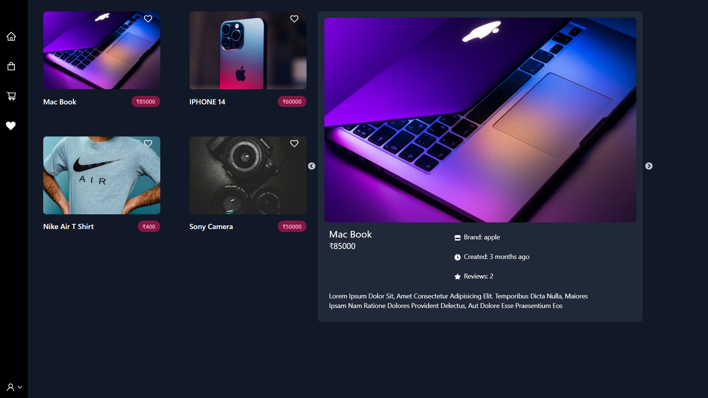
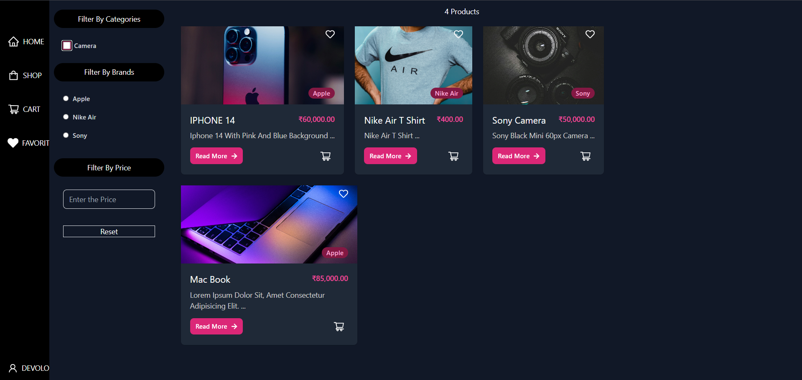
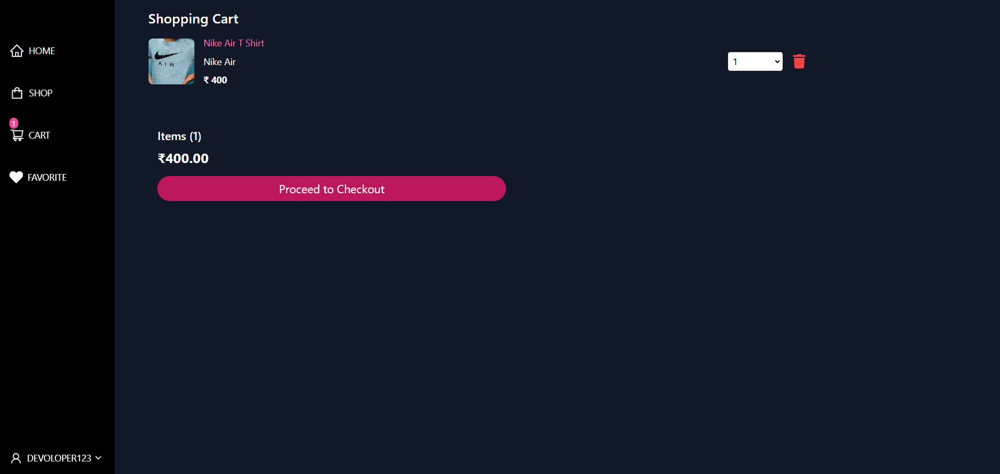
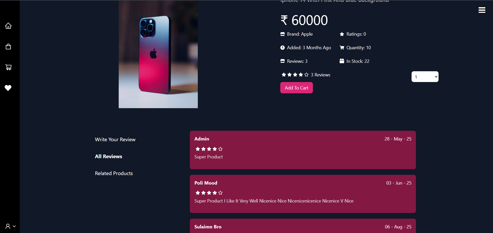
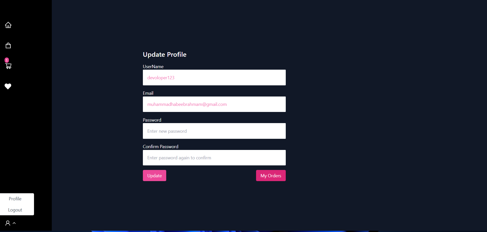
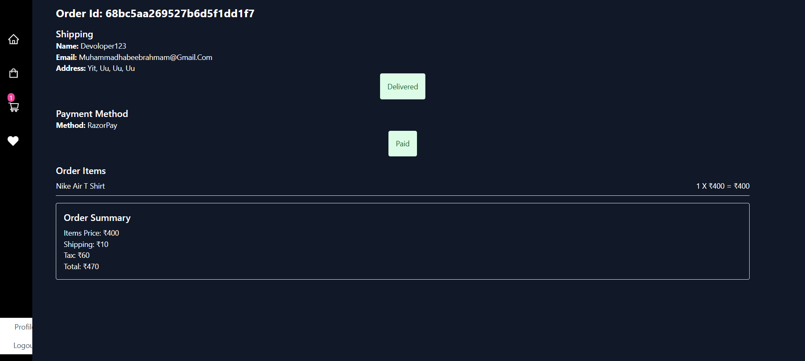
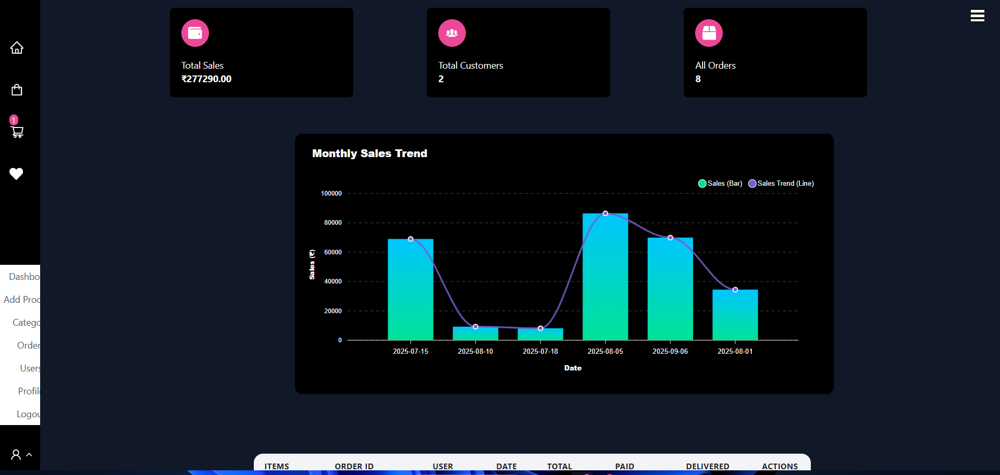
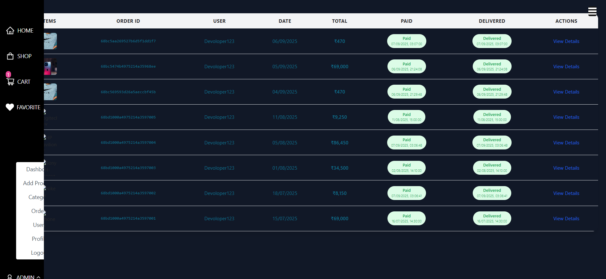
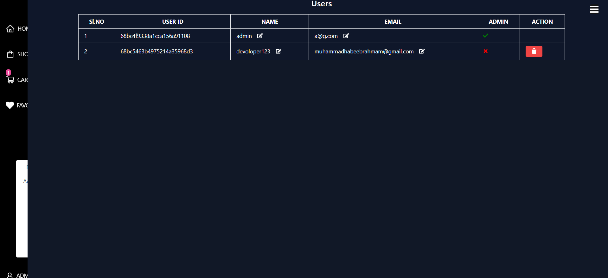
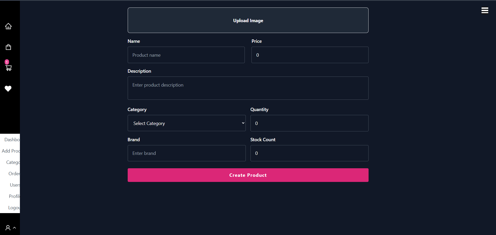

# 🛒 MERN E-commerce Fullstack App

**A fullstack MERN e-commerce app with Razorpay payments, authentication, and order management.**

---
## Live Demo : [Click here](https://e-com-pqll.onrender.com/)
## 📖 About the Project

This is a **MERN-style fullstack application** combining a Node.js/Express backend with a modern frontend (React/Vite/Next.js).  
The app is structured for scalability and developer productivity, with a clear separation of concerns between backend and frontend.

Key features include:

- 🖥 **Frontend** – Built with React/Vite/Next.js for a fast and responsive UI.
- ⚙️ **Backend** – Powered by Express.js with a modular setup.
- 🛢 **Database Ready** – MongoDB-compatible structure, with sample JSON files provided for testing and seeding data.
- 💳 **Payments & Logs** – Razorpay integration with transaction logs (`logs/payments.log`) for tracking.
- 📊 **Charts & Dashboard** – Interactive charts showing sales trends, users, and orders.
- 🔄 **Dev Workflow** – Run backend and frontend together or separately using simple npm scripts.

This project is ideal for:

- Learning how to integrate frontend and backend seamlessly.
- Testing features with pre-made sample data.
- Extending into a production-ready fullstack application.

---

## 🛠 Tech Stack & Key Features

### ⚙️ Backend (API & Server)

- **Node.js** – JavaScript runtime
- **Express.js** – Backend framework for REST APIs
- **MongoDB + Mongoose** – Database & ODM for users, orders, and products
- **Nodemon** – Auto-restart backend during development

### 🖥 Frontend (UI/Client)

- **React / Vite / Next.js** – Modern frontend framework
- **Tailwind CSS** – Utility-first CSS framework for fast styling
- **Axios / RTK Query** – For API requests & state management

### 💳 Payments & Transactions

- **Razorpay** – Integrated payment gateway for secure transactions
- **Payment Logs** – All payment activity is tracked in `logs/payments.log`

### 🔐 Authentication & Security

- **JWT (JSON Web Tokens)** – For secure user authentication
- **Bcrypt.js** – For password hashing
- **dotenv** – Environment variable management

### 🛒 E-commerce Features

- Cart & Orders – Add to cart, checkout, and place orders
- Payment Status Tracking – Paid / Unpaid orders
- Delivery Tracking – Delivered / Not Delivered orders

### 📊 Charts & Dashboard

- **ApexCharts / ** – Interactive visualizations for sales, users, and orders
- Sales trends displayed per day or month
- Customers and orders visualized with bar, line, or grouped charts
- Fully responsive and dynamic charts based on real-time data from API

---

## 🏗 Project Structure

```
project-root/
├── backend/ # Express.js backend
│ └── index.js
├── frontend/ # React/Vite ,package.json 
├── logs/ #  payment logs
│ └── payments.log
├── package.json # Root package.json (scripts included)
```

---

## 📦 Development Scripts

```bash
npm run backend      # Runs backend with nodemon
npm run frontend     # Runs frontend inside frontend/
npm run dev          # Runs both backend & frontend concurrently
npm run prepare      # Prepares required folders (like uploads)
```

> Running the App
> Run both servers together:
## Set up your .env files in both front end and root 
root .env
```bash
MONGO_URI=your_mongo_db_url
PORT=9999
JWT_SECRET=Your_JWT-Secert

node_ENV='development'

# openssl rand -base64 64
Tax_Percent=0.15


RAZORPAY_KEY_ID=rzp_test_key
RAZORPAY_KEY_SECRET=RAZORPAY_SECRET

```

```bash
npm run dev
```

> Run backend only:

```bash
npm run backend
```

> Run frontend only:

```bash
npm run frontend
```

> [!NOTE]\
> some json file are given in the root directory for testing purpose
> hope you like it

> [!NOTE]\
>to login as admin update the database 
---

### 🔗 Useful Links

[Razorpay Documentation](https://razorpay.com/docs/)

[React Documentation](https://react.dev/)

[MongoDB Documentation](https://www.mongodb.com/docs/)

[ApexCharts Docs](https://apexcharts.com/docs/)

> [!IMPORTANT]
> THIS PROJECT IS [LICENSED](https://github.com/muh-habeeb/huxn_ecom/blob/main/LICENCE)<br>
> USING OR MODIFYING WITHOUT EXPLICIT APPROVE IS PROHIBITED AS PER LAW

> [!NOTE]
> CONTACT<br/>
> WAPH: [91 965 680 5212](https:/wa.me/919656805212)<br/>
> MAIL: [muhhabeeb787@gmail.com](mailto:muhhabeeb787@gmail.com)


# Screen Shots

## home


## shop


## cart


## product page 


## profile


## order View


# Admin

## dashboard

## all orders

## all users

## all products

## add  products

